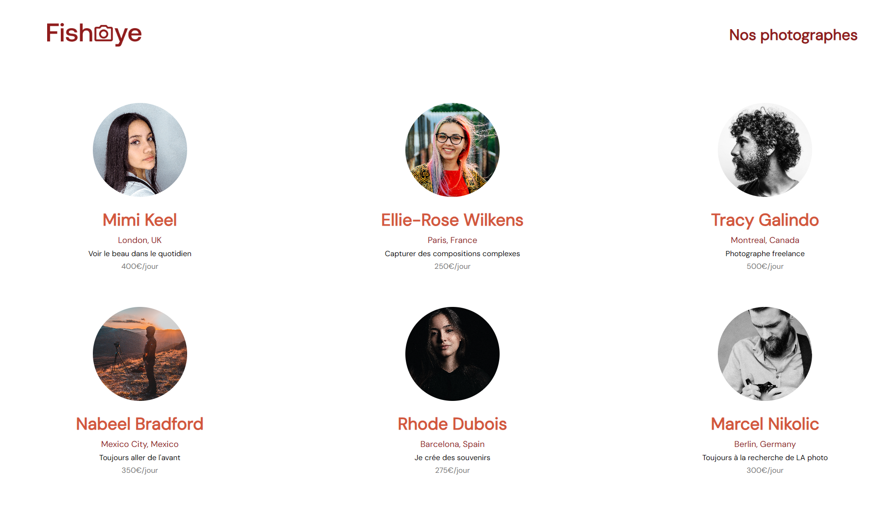
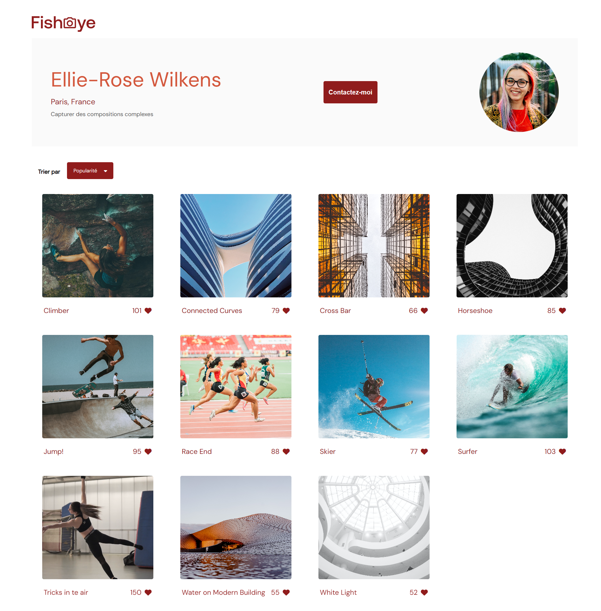

# FishEye: Platform for Freelance Photographers

[Lire ce fichier en français](./README_FR.md)

## Description

FishEye is an online platform that allows freelance photographers to showcase and sell their photographs and videos. This project aims to create a modern and accessible website to increase the visibility of photographers' work. FishEye offers visitors the opportunity to directly contact photographers for engagements or purchases.

## Technologies Used

## Design

FishEye's design was conceived to provide an intuitive and aesthetically pleasing user experience, while highlighting the work of photographers.

### User Interface

The user interface design focuses on simplicity and accessibility. The visual elements enable easy navigation and showcase the photographers' photos and videos effectively.

### Mockups

Mockups were developed to preview the final look of the site before development. You can view the mockups for each main page to understand the structure and flow of the user interface:

-   **Homepage**: Displays a list of all photographers with a quick overview of their profile.
-   **Photographer Profile Page**: Details the photographer's portfolio along with options to contact or like their work.

### Screenshots

Here are some screenshots that illustrate the final result of the site:

These images provide a glimpse of the interactive and responsive design of the site, designed for a wide range of devices and screen sizes.

## Installation

Follow these steps to install and run the FishEye project on your local machine for development and testing.

### Prerequisites

Ensure you have Node.js installed on your machine. If not, you can download and install it from the [official Node.js website](https://nodejs.org/).

### Cloning the Repository

Open your terminal and type the following command to clone the GitHub repository:
`git clone https://github.com/IbrahimAlsabr/FishEye.git`

### Installing Dependencies

Change directory to access the cloned project folder and install the necessary dependencies:

`cd FishEye`

`npm install`

### Launching the Application

To start the application, run the following command in the terminal: `npm start`

This will launch the local server and automatically open the project in your default browser. If it does not open automatically, you can access the application by typing `localhost:3000` in your browser's address bar (ensure that port `3000` is the configured port for your project).

## Author

  
